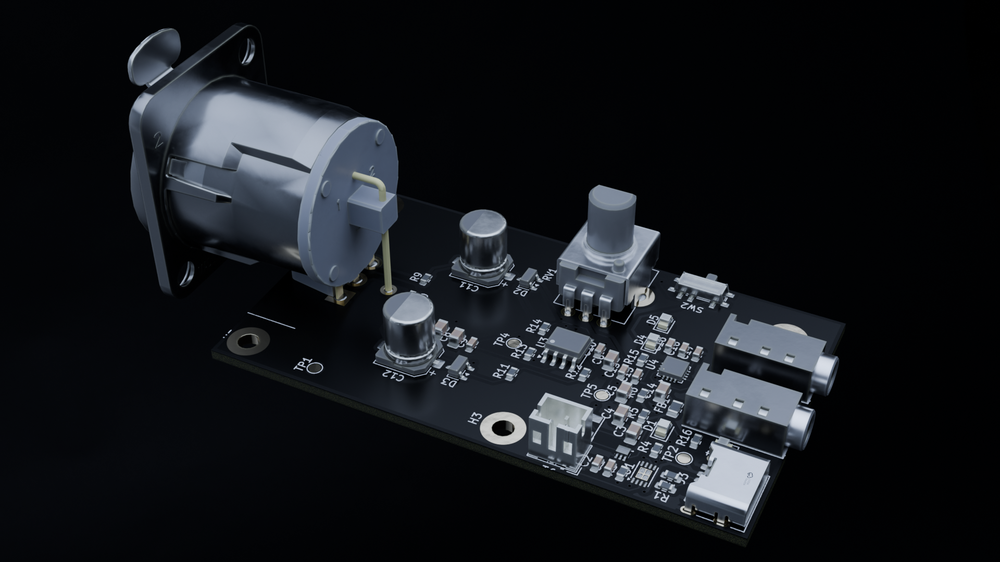
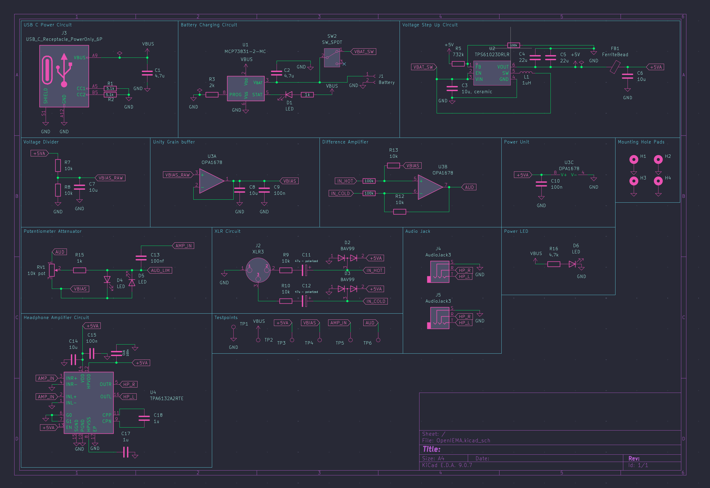
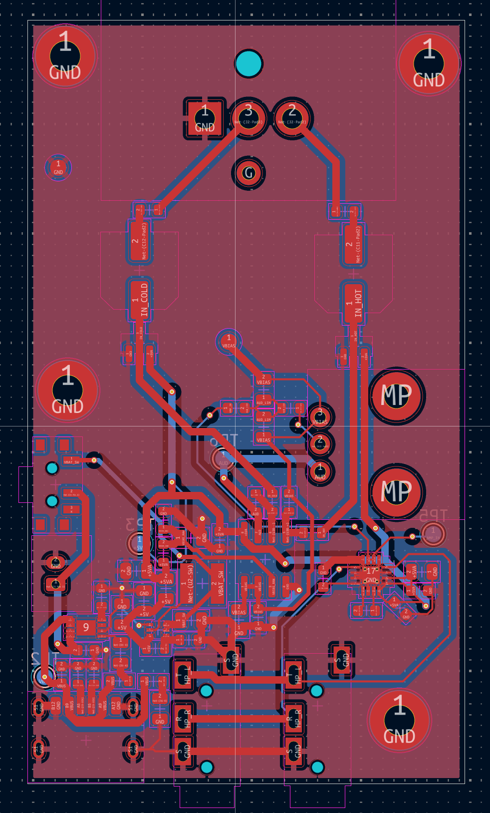
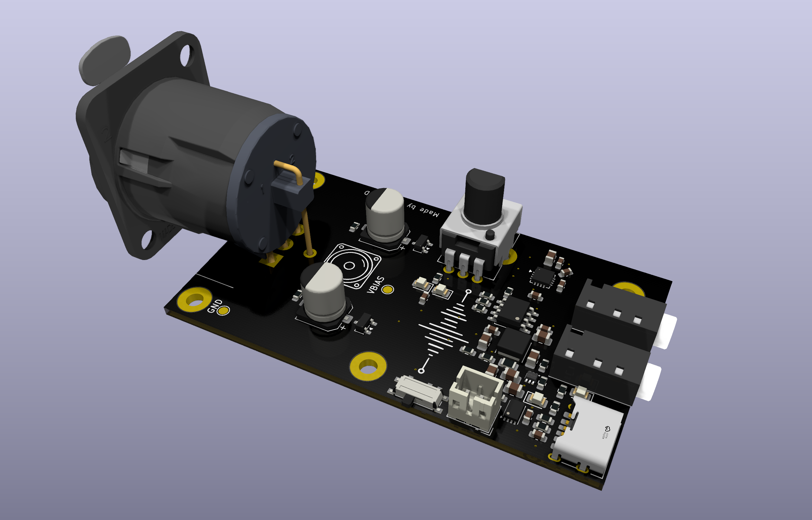
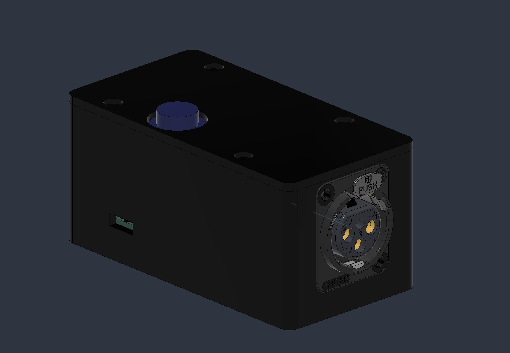

# OpenIEMA

OpenIEMA is an Open Source, In Ear Monitor Amplifier built as an alternative to the Behringer P2 with dual headphone outputs driven from a mono balanced XLR input, with onboard LiPo power and USB-C charging!!

## Key Features

- **True balanced input** : Neutrik XLR into an OPA1678 differential line receiver which ensures any long cable runs from the mixer stay noise free
- **Dual 3.5mm outputs** : supports up to two IEM users off one beltpack, driven by a TI TPA6132A2 DirectPath amp!
- **Analog soft limiter** : anti parallel LEDs act as soft limiters that clamp excess noise before you hear it!
- **Fully portable** : Uses a 1S LiPo with USB C charging (MCP73831, 500 mA) and a boost converter to a clean 5 V analog rail, charges while switched off
- **Zero firmware** : 100% analog signal path built for simplicity
- **3D-printed enclosure** : Includes a 3D printed enclosure with volume control all in a compact package!

## PCB

40 × 70 mm, 2-layer, designed in KiCad 10.

**Schematic:**

**Layout:**

**3D View:**

## Case

Designed in Fusion 360

## Credits

This project uses:

- [KiCad 10](https://www.kicad.org/) for schematic capture and layout
- [pcb2blender](https://github.com/30350n/pcb2blender) for the Blender renders
- TI TPA6132A2 + OPA1678, Microchip MCP73831, TI TPS61023

## License

MIT

---

> [aaravj.tech]() · GitHub [@aaravjhamb](https://github.com/aaravjhamb/)
